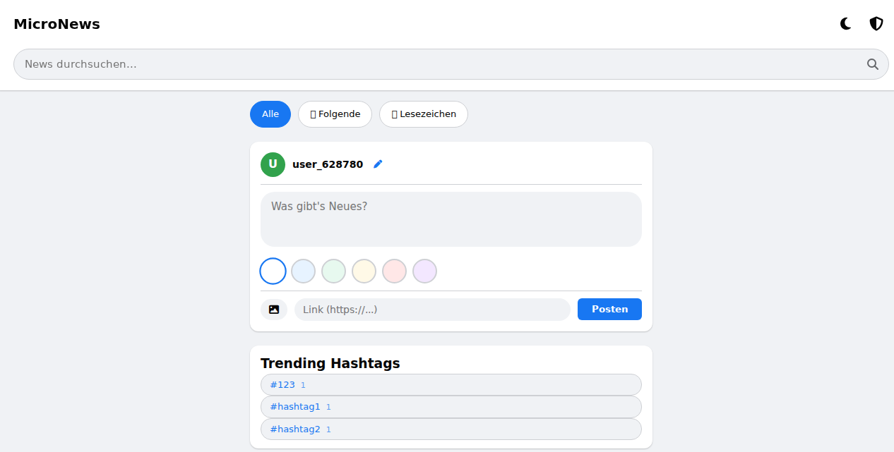
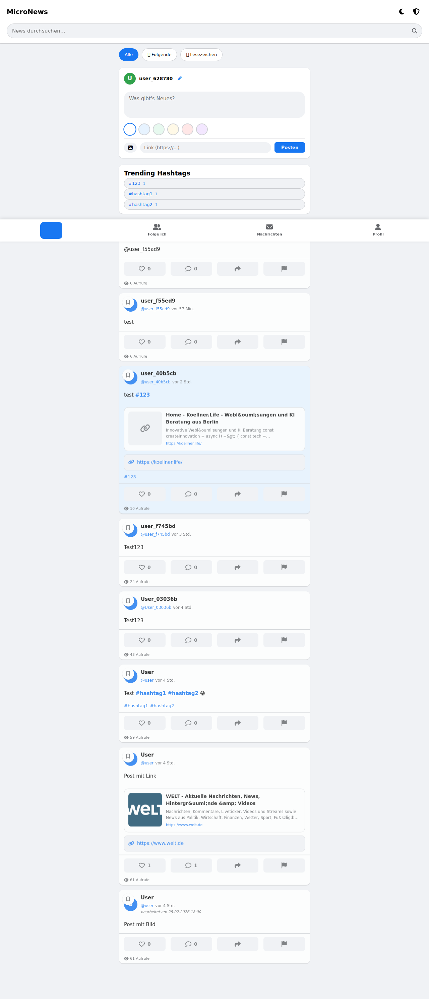

# txtr.me



[](https://github.com/hcscmedia/txtr.me/actions/workflows/ci.yml)
[](https://github.com/hcscmedia/txtr.me/releases)


Dateibasierte PHP-Micro-Social-App mit Feed, Profilen, Follow-System, Direktnachrichten und Admin-Dashboard.

## Menü

- [Überblick](#überblick) - [Screenshot](#screenshot) - [Features](#features) - [Technischer Stack](#technischer-stack)
- [Projektstruktur](#projektstruktur) - [Schnellstart](#schnellstart) - [Qualitätssicherung](#qualitätssicherung)
- [Monitoring](#monitoring) - [Konfiguration](#konfiguration) - [Sicherheit](#sicherheit) - [API-Übersicht](#api-übersicht)
- [Datenmodell (JSON-Dateien)](#datenmodell-json-dateien) - [Deployment-Hinweise](#deployment-hinweise) - [Troubleshooting](#troubleshooting)
- [Release-Checkliste](#release-checkliste) - [Contributing](#contributing) - [Weiterentwicklung](#weiterentwicklung)

## Überblick

`txtr.me` ist eine leichtgewichtige Web-App ohne Framework und ohne relationale Datenbank.
Alle Inhalte werden in JSON-Dateien gespeichert. Dadurch ist die App einfach aufzusetzen, eignet sich für kleine bis mittlere Installationen und lässt sich unkompliziert lokal entwickeln.

## Screenshot



## Features

### Benutzer & Feed
- Post erstellen (Text, Link, Bild, Farbe)
- Likes, Kommentare, Bookmarks, Meldungen
- Suche über Text, @Nutzer und #Hashtags
- „Following“-Feed
- In-App-Benachrichtigungen (Like, Kommentar, Follow, DM)

### Profile & Social
- Profilseite mit Bio und Kennzahlen
- Follow/Unfollow
- Follower-/Following-Listen

### Nachrichten
- Direktnachrichten zwischen Usern
- Konversationsübersicht
- Ungelesen-Zähler

### Admin
- Admin-Login
- Post-Analytics
- Post bearbeiten/löschen
- User sperren/entsperren/löschen
- Bulk-Aktionen
- Activity-Log
- Datenexport

## Technischer Stack

- **Backend:** PHP (prozedural)
- **Frontend:** Vanilla JavaScript + HTML + CSS
- **Storage:** JSON-Dateien im Projektverzeichnis
- **Icons:** Font Awesome (CDN)

## Projektstruktur

- `index.php` – Hauptseite/Feed
- `api.php` – zentraler API-Endpunkt
- `config.php` – Konfiguration + Geschäftslogik + Hilfsfunktionen
- `profile.php` – Profilseite
- `messages.php` – Nachrichtenansicht
- `admin.php` + `admin.js` – Admin-Dashboard
- `app.js` – Haupt-Frontendlogik
- `style.css` – Styles
- `sw.js`, `manifest.json` – PWA-Bausteine
- JSON-Dateien (`users.json`, `news_data.json`, `messages.json`, …) – Datenhaltung

## Schnellstart

### Voraussetzungen
- PHP 8.x

### Lokaler Start

```bash
ADMIN_PASSWORD='ein-starkes-passwort' php -S 127.0.0.1:8080
```

Dann öffnen:

```text
http://127.0.0.1:8080/index.php
```

## Qualitätssicherung

Ein ausführbarer Smoke-Test liegt unter:

- `scripts/smoke_test.py`

### Smoke-Test gegen laufende Instanz

```bash
python3 scripts/smoke_test.py --base-url http://127.0.0.1:8080 --admin-password 'dein-passwort'
```

### Smoke-Test mit automatisch gestarteter Testinstanz

```bash
python3 scripts/smoke_test.py --start-server --base-url http://127.0.0.1:8080 --admin-password 'smoke-secret'
```

Der Test deckt Kernflows ab (User/Follow/Post/Admin/CSRF/Health) und gibt bei Erfolg `SMOKE_OK` aus.

## Monitoring

Health-Endpoint:

- `GET /health.php`

Beispiel:

```bash
curl -s http://127.0.0.1:8080/health.php | jq
```

Antwortfelder (Auszug):

- `status`: `ok`, `warn` oder `error`
- `checks`: Datei-/Schreibbarkeitsstatus für Kernressourcen
- `php_version`, `time`

## Konfiguration

Wichtige Konstanten liegen in `config.php`:

- `MAX_POSTS`
- `MAX_FILE_SIZE`
- Dateinamen für JSON-Daten

Admin-Zugang:

- `ADMIN_PASSWORD` wird **aus Umgebungsvariable** gelesen.
- Ohne gesetzte Variable ist kein Admin-Login möglich.

## Sicherheit

### Bereits umgesetzt

- **Kein hartkodiertes Default-Adminpasswort**
- **CSRF-Schutz** für sensible Admin-POST-Aktionen über `X-CSRF-Token`
- **Rate-Limits**:
	- Login: 5 Versuche / 5 Minuten / IP
	- Report: 10 Meldungen / 5 Minuten / User+IP
- **Link-Preview-Härtung**:
	- Blockiert lokale/private Ziele
	- TLS-Verifikation aktiv
- **Robuste JSON-Schreibvorgänge**:
	- atomar via Temp-Datei + Rename
	- `LOCK_EX` zur Reduktion von Race-Conditions

## API-Übersicht

Die API läuft zentral über `api.php`.

### GET-Actions (Auszug)
- `get_posts`
- `get_stats` (Admin)
- `get_analytics` (Admin)
- `get_users` (Admin)
- `get_activity_log` (Admin)
- `get_conversations`
- `get_conversation`
- `get_unread_count`
- `get_followers`
- `get_following`
- `load_draft`
- `get_post_detail` (Admin)
- `export_data` (Admin)

### POST-Actions (Auszug)
- `login`, `logout`
- `set_username`, `update_profile`
- `follow`, `unfollow`
- `create`, `edit_post`, `delete`
- `like`, `comment`, `bookmark`, `report`, `view`
- `send_message`
- `ban_user`, `unban_user`, `delete_user` (Admin)
- `bulk_delete`, `bulk_report` (Admin)

> Hinweis: Sensible Admin-Aktionen benötigen gültige Admin-Session und CSRF-Token.

## Datenmodell (JSON-Dateien)

Typische Dateien:

- `news_data.json` – Posts inkl. Kommentare/Likes/Reports
- `users.json` – Userprofile
- `messages.json` – Direktnachrichten
- `notifications.json` – In-App-Benachrichtigungen
- `activity_log.json` – Admin-/System-Events
- `follows.json` – Follow-Beziehungen
- `rate_limits.json` – Rate-Limit-Zustände
- `bookmarks_<user>.json`, `draft_<user>.json` – userbezogene Hilfsdaten

## Deployment-Hinweise

- Immer starkes `ADMIN_PASSWORD` setzen
- App nur über HTTPS betreiben
- Schreibrechte für JSON-Dateien und `uploads/` korrekt setzen
- Regelmäßige Backups der JSON-Daten durchführen
- Optional: Reverse Proxy mit zusätzlichem Rate-Limiting einsetzen

Spezifische Anleitung für Spaceship:

- `docs/spaceship-deploy.md`

Lokale Installation mit XAMPP:

- `docs/xampp-localhost.md`

## Troubleshooting

### `Admin-Passwort ist nicht konfiguriert`
Setze `ADMIN_PASSWORD` beim Serverstart:

```bash
ADMIN_PASSWORD='...' php -S 127.0.0.1:8080
```

### `403 Ungültiger CSRF-Token`
- Seite neu laden (Token wird in Session erzeugt)
- Prüfen, ob Requests den Header `X-CSRF-Token` senden

### `429 Zu viele ...`
- Rate-Limit aktiv, kurz warten und erneut versuchen
- In Entwicklung ggf. `rate_limits.json` bereinigen

### Keine Daten / Fehler beim Speichern
- Dateirechte für JSON-Dateien prüfen
- Schreibrechte auf Projektverzeichnis/`uploads/` sicherstellen

## Release-Checkliste

Für wiederholbare Patch-Releases (z. B. `v1.0.1`) siehe:

- `docs/release-checklist.md`

## Contributing

Beitragsrichtlinien und Entwicklungsworkflow:

- `CONTRIBUTING.md`

## Weiterentwicklung

Sinnvolle nächste Schritte:

- Automatisierte Tests für kritische API-Flows
- Optionaler DB-Modus (SQLite/MySQL) als Alternative zu JSON
- Verbesserte Moderations-Workflows (z. B. Review-Queue)
- CI-Pipeline mit Lint + Smoke-Tests
